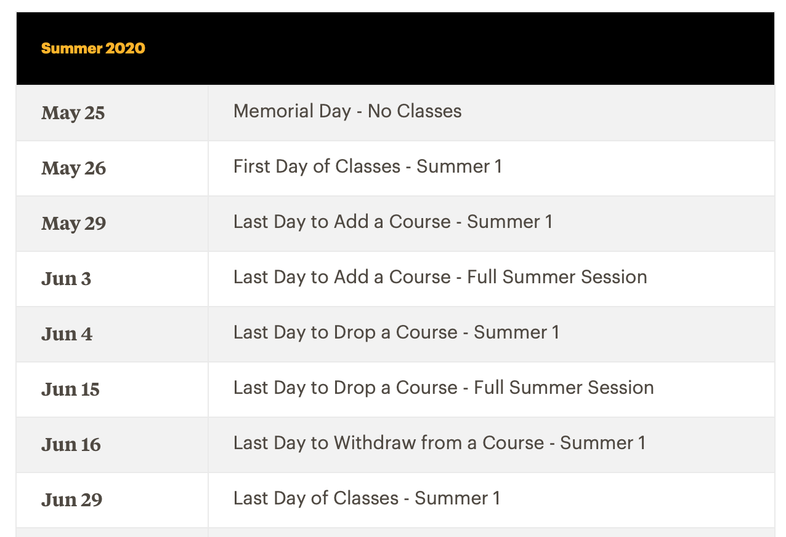

This past July, we proudly launched Adelphi University's [new website](https://adelphi.edu). Ever since we received ownership of our new Wordpress CMS from the company we partnered with, it's been an exciting (and sometimes challenging) journey in Wordpress development. Lots of learning as a team on how to not only better develop in Wordpress, but how to manage content and assets. In the short time since we received our new Wordpress CMS and went live, we made the following changes / customization:

##New Academic Calendar Plugin

<!--  -->

I modified an old custom Wordpress plugin from our old site to pull in academic calendar info from our new LiveWhale events calendar API. I built this plugin about 5 years ago to pull in data from a Google Sheet maintained by the Registrar, but revisiting this gave me the opportunity to rethink how I originally built these shortcodes, making them more modular and flexible for everyone on the team to create a separate table listing for each semester. The results can be seen [here](https://www.adelphi.edu/academics/academic-calendar/). I'm hoping to move away from building custom plugins for this type of stuff, instead using our new ACF Components architecture, but it's a step in the right direction.

##New Personnel and Department Directory

Our old web directory was well over a decade old, and replete with years of hacks to ensure the correct display of data. Just before we partnered on development with our vendors, our team did a Design Thinking session to define the new directory would shape up. It was fun process that allowed us to really tear everything down and focus on a new solution that all relevant stakeholders were able to help inform.

##Partnership with Livewhale

In order to provide a single solution for online event management, we partnered with Livewhale to set up a system for our team to enter events, as well as aggregate events from various third party systems (such as Slate, CampusLabs, and Handshake). We build a solution to periodically sync the Livewhale REST API containing all events into our Wordpress "Event" post type. This last part was challenging due to different nature of how some of these events run (single day vs. multi-day), but our team knocked this out of the park to ensure that all events are listed on our site in a way that makes sense.

##Advanced Custom Fields FTW

I'm really liking our new ACF (Advanced Custom Fields) plugin. It gives our Wordpress instance the flexibility to quickly add Postmeta fields to our pages and post types, and extend the full-width and in-content components that came with our new site. It also makes setting up admin screens to manage our Postmeta data much easier.

##Gulp!

Our new website was developed with Sass CSS files (something we pushed for early on). For the first time, all our CSS can be maintained modularly, and we can set our fonts and color palettes once. Javascript changes will also now be a breeze since everything is organized and compiled down to a single "site.js" file via Gulp. In addition we are using Gulp to manage SVG icons on the site. Next step will be to minify everything for faster load times.

##Takeaways

For the first time, I'm really excited about Wordpress as a development platform, and how much further we can extend our website into our overall Digital Strategy.