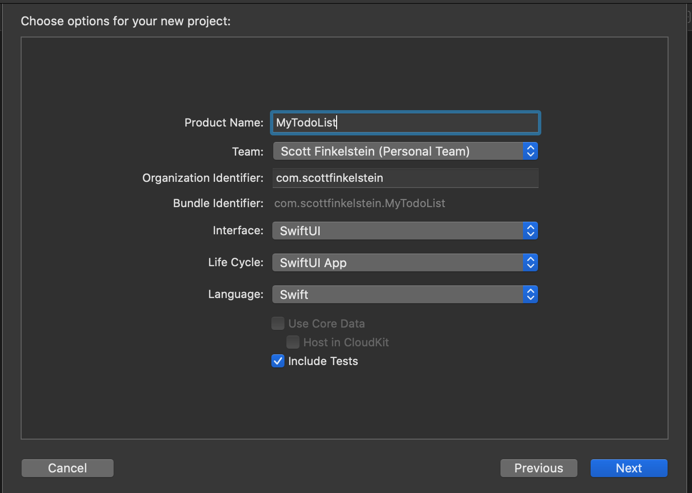
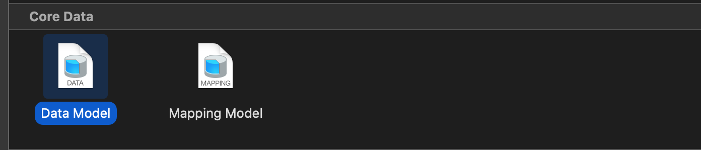
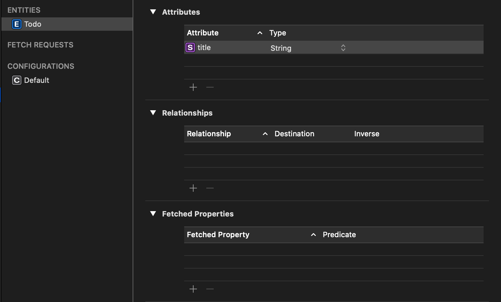

With the announcement of iOS 14 and Xcode 12, I was very excited to see that you can now create an iOS project with a new SwiftUI Life Cycle. Gone are the AppDelegate and SceneDelegate files. Along with this, You no longer have the "Use Core Data" checkbox which has always saved some coding time by adding the Core Data model, as well as all the code and methods needed to saved and retrieve data. I've been guilty of relying too much on ticking this checkbox as a way of saving some time, however, thanks to simpler nature of SwiftUI, configuring Core Data is no longer the scary monster it once was.

To demonstrate how to add Core Data to an iOS 14 app from scratch, create a new project, using the options in the screenshot above, making sure you have "SwiftUI App" selected for your app's live cycle.

Once your project is created, you'll want to open up the new SwiftUI entry point. The file will have the name of your app with with the word "App." In my case, since my app is named "MyTodoList", my SwiftUI entry point file is called "MyTodoListApp.swift."

`gist:scottfinkelstein/96ad4c88b43ed59dfb40cc00500a4591`

Note that our struct subclasses "App", and sets your ContentView struct as the main view.

Next we will create a Core Data model file by going to the "file" menu, "new > file..." and choosing "Data Model" under the "Core Data" section.

In keeping things simple, lets call this file "MyDataModel." Once it's created open it up and add a new entity named "Todo" with a single attribute named "title" with the type set to "String."

Next we will want to create a new class which will allow us to access our new Data Model. For this, I like to use the Singleton pattern to ensure we are referencing the same data store regardless of where we are in the app.

`gist:scottfinkelstein/0fb3ea2f496860e09d67401aade07ecc`

What we are doing here is importing the CoreData framework, and again, using the singleton pattern, creating a static "shared" variable that holds the one instance of the class. I then create my persistent container referencing my data model file, keeping this all in a lazy var that will only instantiate when I eventually call it from ContentView. I also create the "saveContext()" method which we can call upon running any CRUD action on our data. If all this looks familiar it's because this is what was previously generated for us in our old AppDelegate files.

Next we need to add our new DataStore class to our MyTodoListApp.swift file:

`gist:scottfinkelstein/28dc51cf0e1b9d2522f0493d29007122`

Here I'm creating a context variable from the persistent container in our DataStore singleton, and adding as an environment variable to our ContentView. Jumping into our ContentView we have the following:

`gist:scottfinkelstein/28dc51cf0e1b9d2522f0493d29007122`

Now, lets run our app and make sure everything works:

`youtube:https://www.youtube.com/embed/53VBDGYRx5E`

Success! Now we have Core Data happily in place and running in a much less complex SwiftUI project.

With all of the new SwiftUI features forthcoming in iOS 14, we'll still be able to use Core Data without losing a beat.