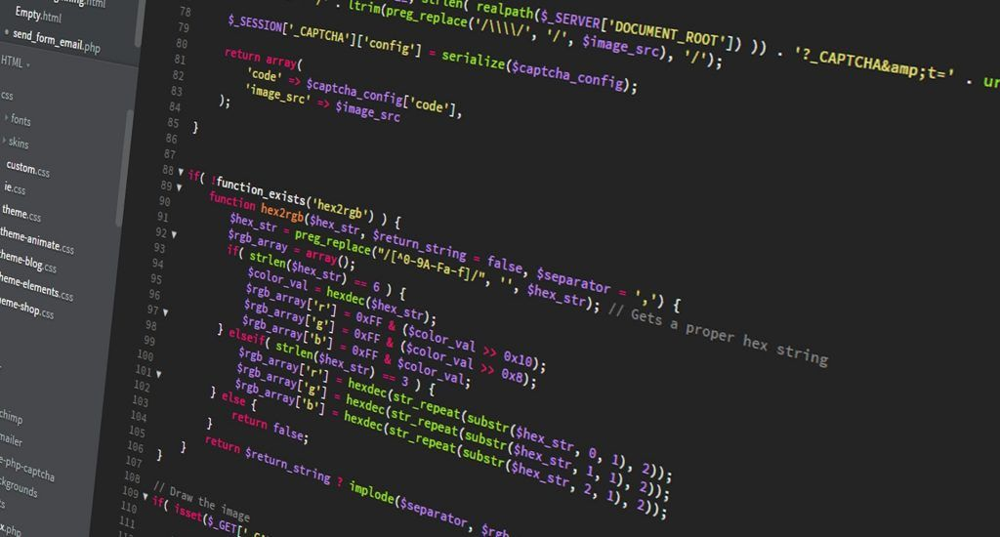
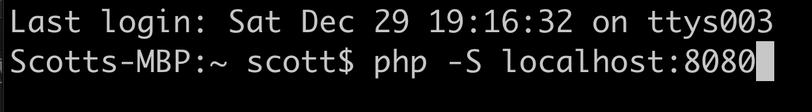

“Don’t you know how much time you would save if you used a framework?”

“Ruby on Rails was good enough to build Twitter with. You should use it for your application.”

“Dude! PHP is so 1996!”

I used to think these <sarcasm>self-affirmations</sarcasm> to myself whenever I had an idea for a project. I’d spent a mind numbing amount of time trying to decide on what sweet new framework to build it in, only to lose interest and not get anything off the ground.

I have nothing against Ruby on Rails, Django (Python), Laravel (PHP), or even Express (server-side JS). What I don’t like is being fenced into something that will be almost impossible to scale years or even months later. Granted, Ruby on Rails did allow Jack Dorsey and Biz Stone to get the early version of Twitter to market fast, but they too saw the limitations and moved off of it.

My true home is in the wild frontier of classic PHP, where I can meticulously set up my own project directories. Where else can one appreciate the minimalistic beauty of running “php -S localhost:8080” to test your work locally. If I need a more robust server environment, I can always spin up a Docker container.

<small>All you need to run a PHP web app locally</small>

Why is PHP my back-end web language of choice? Deploying a PHP application doesn’t require the painstaking server configuration that you need to do with Ruby and Python. You simply drop your php file into the public web directory, point your browser at it. That’s all there it is to it!

Don’t let anyone “Framework Shame” you. Your users could care less how you built the app. You will be their hero as long as the app works. Use the tools you are most comfortable with.

